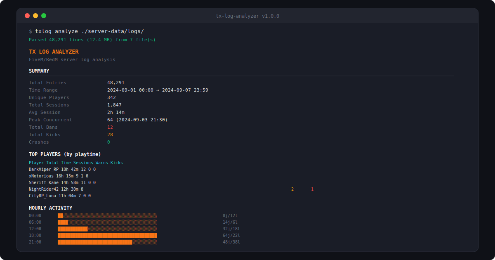

# tx-log-analyzer

CLI tool to analyze txAdmin logs from FiveM and RedM servers. Parses player sessions, bans, kicks, crashes, and resource performance.



## Install

```bash
npm install -g tx-log-analyzer

# Or run directly
npx tx-log-analyzer analyze ./server-data/logs/
```

## Usage

### Analyze logs

```bash
# Analyze a single log file
txlog analyze ./admin.log

# Analyze all .log files in a directory
txlog analyze ./server-data/logs/

# Export report to JSON
txlog analyze ./server-data/logs/ --output report.json

# Show top 20 players
txlog analyze ./server-data/logs/ --top 20
```

### Watch mode

```bash
# Watch a log file in real-time
txlog watch ./admin.log

# Filter by action type
txlog watch ./admin.log --filter player.ban
```

### List players

```bash
# List all unique players sorted by playtime
txlog players ./server-data/logs/

# Sort by session count
txlog players ./server-data/logs/ --sort sessions
```

## What it analyzes

| Category | Details |
|----------|---------|
| **Sessions** | Join/leave tracking, duration, peak concurrent, hourly activity chart |
| **Bans** | Ban records with admin, reason, duration, repeat offender detection |
| **Kicks** | Kick log with reasons and admin actions |
| **Crashes** | Server crash detection with uptime, last players, possible cause |
| **Resources** | Resource start/stop/error tracking, slowest resources, error rates |

## SDK

```typescript
import { LogParser, SessionAnalyzer, BanAnalyzer } from "tx-log-analyzer";

const parser = new LogParser();
const result = parser.parse("./admin.log");

const sessions = new SessionAnalyzer();
const { summaries, peakConcurrent } = sessions.analyze(parser.extractPlayerEvents());

console.log(`Peak: ${peakConcurrent} players`);
console.log(`Unique: ${summaries.length} players`);
```

## Supported log formats

- txAdmin v6.x and v7.x log structure
- Standard FiveM/RedM server console logs
- Custom `[timestamp] [level] message` format

## Project Structure

```
src/
├── cli/
│   └── index.ts           # CLI commands (analyze, watch, players)
├── parser/
│   ├── log-parser.ts      # Core log file parser
│   ├── patterns.ts        # Regex patterns for txAdmin logs
│   └── types.ts           # TypeScript interfaces
├── analyzers/
│   ├── sessions.ts        # Player session tracking
│   ├── bans.ts            # Ban/kick/warn analysis
│   ├── crashes.ts         # Server crash detection
│   └── resources.ts       # Resource performance
├── reporters/
│   ├── console.ts         # Terminal output with charts
│   └── json.ts            # JSON export
├── utils/
│   └── format.ts          # Formatting helpers
└── index.ts               # SDK exports
```

## License

MIT — free to use, modify, and distribute.

---

## 🇫🇷 Documentation en français

### Description
tx-log-analyzer est un outil CLI pour analyser les logs txAdmin des serveurs FiveM et RedM. Il parse les sessions des joueurs, les bannissements, les kicks, les crashs et les performances des ressources pour produire des rapports détaillés. Indispensable pour les administrateurs de serveurs de jeu souhaitant surveiller et auditer leur infrastructure.

### Installation
```bash
npm install -g tx-log-analyzer
```

### Utilisation
```bash
tx-log-analyzer --file /chemin/vers/txAdmin.log
```
Consultez la documentation en anglais ci-dessus pour la liste complète des commandes, options et formats de sortie disponibles.
